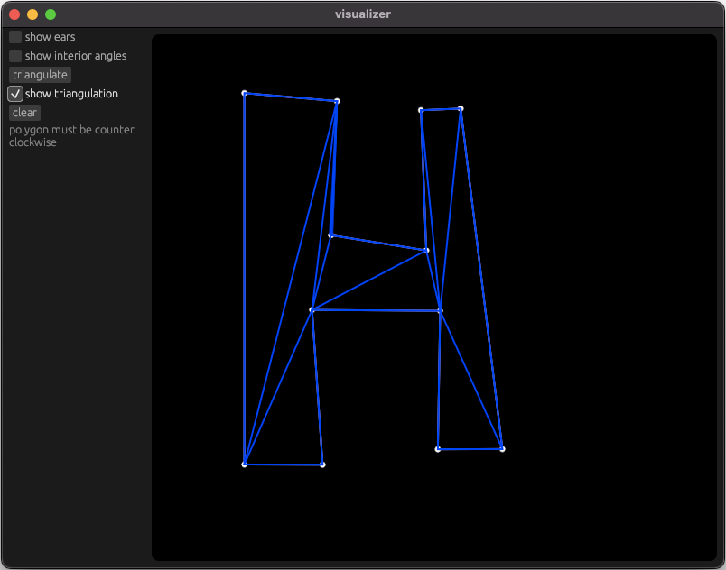

# triangulator

A library for triangulation.

The order of the points must be counterclockwise in a Cartesian coordinate system with inverted y-axis.

Polygons with holes are not supported yet, but maybe I will implement it in the future.

Resources: [Triangulation by Ear Clipping](https://www.geometrictools.com/Documentation/TriangulationByEarClipping.pdf)
